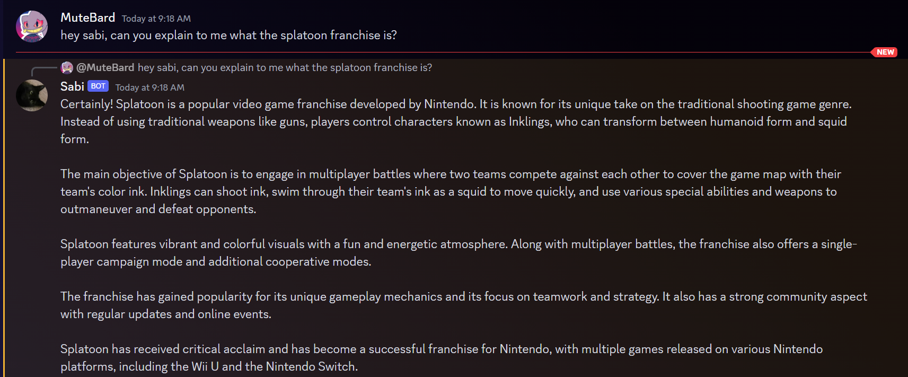

# Sabi - A multipurpose discord bot

## Chat bot / Assistant
When calling Hey Sabi (case and spacing insensitive) followed by text "Hey Sabi"
the chat bot will respond to your question within a discord reply.

Dependent on https://github.com/MuteBard/Chat to create responses. 
Recalls chat history up to 10 prompts by default.
Each message is under 2000 characters to adhere to discord size limits.

### Commands
    Hey Sabi <Your text here>
    !clear

## Testers:
    Kenneth
    https://github.com/thekennyverse